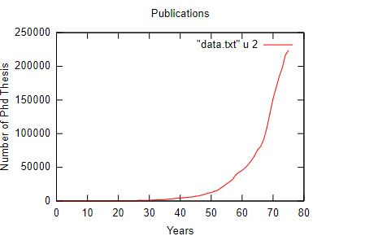

# Time_Serie_Analysis

## Introduction and Data Set
The data set which has used comes from DBLP and its name is “dblp-2020-04-01.xml.gz”. DBLP (https://dblp.uni-trier.de/) is a site that maintains bibliographic data publications, mainly in the field of computer science. In addition to the possibility to navigate and see the data of published works through the website, this data is available as an XML (Extensible) compressed file
Markup Language). As part of this work initially, we have extracted the data we had been interested in,  from the above data set. Then, we presented the data in a time serie form and then proceeded to analyze it with the ultimate goal of predicting future prices. Our data concerns the number of publications per year. So we built a prediction model that could
be used to predict the total number of publication in the future.

## Requirements
We used the Python programming language to extract the data from the XML file. And for the time serie analysis the Gnuplot open-source software tool.

## Implementation 
Publications per year with Gnuplot (Bar Chart): 

Publications per year with Gnuplot (Time Serie form - Line Graph): 

Οur data extends until 2020. We will apply time series analysis techniques until 2010 and then we will compare the predicted values ​​with the real ones in the range 2010-2020.

Publications per year with Gnuplot until 2010:

We find an approximate function given by the following formula: f(x) = 520000 * (x/85) ** 6.8 

We calculate the Residuals by subtracting our function from them data. We observe symmetry around zero and that means we have eliminate the voltage quite well.

We present a smoothed representation of Residual with no smoothed version of Residual, with the ultimate goal of checking if it exists systematic trend in Residual.

Then we check for seasonality, observing its lack.

Finally, we present the prediction model in our total data up to 2020. We observe that the forecast model has an increasing trend.

